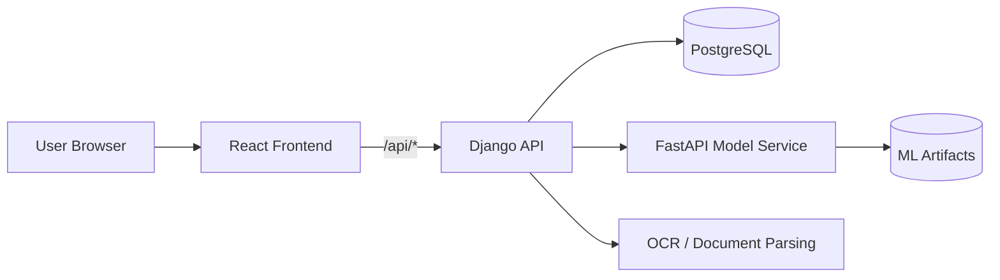

# Quirass AI Fraud and Risk Platform

<p align="center">
   <a href="https://quad-ai-brown.vercel.app">
      
   </a>
</p>

Quirass is a production-style fraud detection and risk operations platform that combines a Django API, a FastAPI model service, and a React dashboard. The system supports transaction scoring, OTP-based authentication, loan request workflows, OCR-assisted ingestion, and admin oversight.

This README explains what the system does, how it is structured, how to run it locally, and how to deploy it on Coolify behind a DigitalOcean VPS.

## What The Platform Does

The application is built to help an organization detect suspicious transactions and manage risk decisions across a user portal and an admin console.

- Scores incoming transactions for fraud risk.
- Uses a separate FastAPI service to host the ML model.
- Stores operational data in a PostgreSQL database in production.
- Supports OCR-assisted document ingestion for screenshots, PDFs, and other transaction artifacts.
- Provides a React web front end for users and admins.
- Exposes health checks for each deployable component.

## System Architecture



### Services

- Frontend: React + Vite + Nginx
- API: Django + Django REST Framework
- Model service: FastAPI + scikit-learn artifacts
- Database: PostgreSQL for production, SQLite fallback for local development

### Why the split matters

The Django app owns business logic, authentication flows, and database writes. The FastAPI service owns ML inference only. This makes deployment easier to scale and isolates model runtime dependencies from the main API.

## Repository Layout

- [campus/](campus/) - Django project and payments app
- [src/](src/) - FastAPI model service
- [frontend/](frontend/) - React user interface
- [models/](models/) - Serialized ML artifacts
- [docker-compose.coolify.yml](docker-compose.coolify.yml) - production compose file for Coolify
- [Dockerfile.django](Dockerfile.django) - Django container
- [Dockerfile.fastapi](Dockerfile.fastapi) - model service container
- [Dockerfile.frontend](Dockerfile.frontend) - frontend container
- [DOCKER.md](DOCKER.md) - deployment notes and environment variables

## Main Features

- Fraud scoring with a dedicated model service.
- OTP request and verification flows for users and admins.
- Transaction ingestion and validation tracking.
- Loan request evaluation and decision support.
- Risk alerts and notification flows.
- Admin analytics and governance views.
- OCR parsing for screenshot and PDF transaction inputs.

## Technology Stack

- Backend: Python, Django, Django REST Framework
- Model API: FastAPI, Uvicorn, scikit-learn, joblib
- Frontend: React 19, Vite, React Router, Tailwind CSS
- Database: PostgreSQL in production, SQLite locally
- Reverse proxy: Nginx for the frontend container
- Deployment: Docker Compose, Coolify, DigitalOcean VPS

## Data And Model Assets

The model service loads serialized artifacts from [models/](models/):

- `random_forest.joblib`
- `scaler.joblib`

The Django layer calls the FastAPI service at `/predict` and normalizes payloads before forwarding them.

## Local Development

### Prerequisites

- Python 3.13 or compatible environment
- Node.js 22 or compatible environment
- Docker and Docker Compose if you want containerized local runs

### Backend

```bash
pip install -r requirements.txt
python campus/manage.py migrate
python campus/manage.py runserver
```

### Frontend

```bash
cd frontend
npm install
npm run dev
```

### FastAPI model service

```bash
python src/api.py
```

## Docker Run

For local containerized runs, use the production compose file:

```bash
docker compose -f docker-compose.coolify.yml up --build
```

## Deployment

Active frontend demo:

- https://quad-ai-brown.vercel.app/demo

Deployment options in this repository:

- `docker-compose.coolify.yml`: full production-style stack on Coolify (frontend + Django + FastAPI + Postgres)
- `docker-compose.yml`: local development stack for quick testing

Hybrid deployment (recommended for optimal performance and demo speed):

1. Serve the React UI on Vercel (current live URL above).
2. Deploy only backend services (`django`, `fastapi`, `db`) on your VPS/Coolify.
3. Point frontend API calls to backend by setting `VITE_API_BASE_URL=https://<your-backend-domain>/api`.
4. On backend, allow the Vercel origin in `DJANGO_CORS_ALLOWED_ORIGINS` and `DJANGO_CSRF_TRUSTED_ORIGINS`.

Backend server performance considerations:

- On smaller servers, OCR and fraud scoring are CPU-heavy, so peak-time latency can rise.
- Single-node deployments can queue requests during burst traffic.
- Cold restarts after deployment may briefly increase response times.

Advantages of this architecture:

- Frontend remains globally fast on Vercel regardless of backend load.
- Backend has health checks and clear service separation for quick recovery.
- Transaction scoring keeps operational continuity by blending local logic with external model scoring.

The stack starts these services:

- `db`
- `fastapi`
- `django`
- `frontend`

See `DOCKER.md` for exact environment variables and service wiring.

## Coolify Deployment

Use Coolify Docker Compose deployment with [docker-compose.coolify.yml](docker-compose.coolify.yml).

### Coolify settings

- Base Directory: `/`
- Docker Compose Location: `docker-compose.coolify.yml`
- Build Pack: `Docker Compose`

### Public routing

- Expose only the `frontend` service publicly.
- Keep `django`, `fastapi`, and `db` internal.
- The frontend Nginx container proxies `/api/*` to Django.

### Required environment variables

Set these in Coolify using values appropriate for your domain and database password:

- `DJANGO_SECRET_KEY`
- `DJANGO_DEBUG`
- `DJANGO_ALLOWED_HOSTS`
- `DJANGO_CSRF_TRUSTED_ORIGINS`
- `DJANGO_CORS_ALLOWED_ORIGINS`
- `DJANGO_SESSION_COOKIE_SECURE`
- `DJANGO_CSRF_COOKIE_SECURE`
- `DJANGO_SECURE_SSL_REDIRECT`
- `DATABASE_URL`
- `FRAUD_MODEL_API_URL`
- `FRAUD_MODEL_API_TIMEOUT_SECONDS`
- `POSTGRES_DB`
- `POSTGRES_USER`
- `POSTGRES_PASSWORD`

See [.env.example](.env.example) for the current reference values.

### Health checks

- Frontend: `/healthz`
- Django: `/api/health/`
- FastAPI: `/health`

## Public Routes

### Frontend

- `/` - marketing landing page
- `/auth` - user authentication
- `/admin/auth` - admin authentication
- `/portal/*` - user portal
- `/admin/*` - admin dashboard

### Django API

- `/api/health/` - health check
- `/api/auth/otp/request/`
- `/api/auth/otp/verify/`
- `/api/predict/`
- `/api/transactions/`
- `/api/loans/requests/`
- `/api/trust/profiles/`
- `/api/notifications/`
- `/api/risk/alerts/`
- `/api/fraud/feedback/`
- `/api/admin/users/`
- `/api/admin/model-monitoring/`

### FastAPI model service

- `/` - service status
- `/health` - health check
- `/predict` - ML scoring endpoint

## Verification And Health

After deployment, verify these URLs in your browser:

1. Frontend root: `https://your-domain/`
2. Frontend health: `https://your-domain/healthz`
3. Django health: `https://your-domain/api/health/`

Expected results:

- Frontend returns the Quirass UI.
- Health endpoints return JSON or a simple `ok` response.
- API requests are proxied through the frontend to Django.

## Troubleshooting

### Build fails in Coolify

- Make sure the compose file path is `docker-compose.coolify.yml`, not `.yaml`.
- Ensure the branch Coolify deploys includes the latest Docker changes.
- If the VPS is low on RAM or disk, prune old Docker resources and redeploy.

### Django health is unhealthy

- Confirm `DATABASE_URL` points to the Postgres service.
- Confirm `DJANGO_ALLOWED_HOSTS` includes your domain and localhost for internal checks.
- Confirm `DJANGO_SECURE_SSL_REDIRECT` remains `false` inside the container stack.

### API calls fail from the frontend

- Verify the frontend is deployed with `VITE_API_BASE_URL=/api`.
- Verify the Nginx proxy config routes `/api/` to Django.

### OCR or model dependencies fail

- The Django image includes Tesseract and OpenCV runtime dependencies.
- The FastAPI image includes the ML runtime packages and model artifacts.

## Development Notes

- Django falls back to SQLite locally when `DATABASE_URL` is not set.
- Production uses PostgreSQL through `DATABASE_URL`.
- `collectstatic` runs during the Django container startup sequence.
- The frontend build is a static bundle served by Nginx.

## Testing And Validation

Recommended checks before submitting the project:

```bash
python -m pytest
python campus/manage.py check
cd frontend && npm run lint
cd frontend && npm run build
```

## Security Notes

- Do not keep the default secret key in production.
- Restrict `DJANGO_ALLOWED_HOSTS` to your actual domains.
- Use HTTPS at the Coolify edge and keep internal services private.
- Store database credentials only in Coolify environment variables.

## License

This project is open-source and available under the MIT License.
