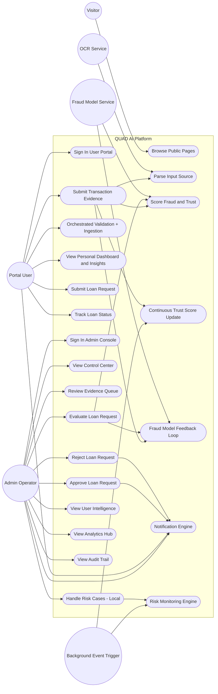

# QUAD AI System Use Case Specification (User + Admin)

Date: 2026-04-05
Scope: End-to-end use cases for portal users and admin operators

## 1. System Boundary

System Name: QUAD AI Trust, Fraud, and Loan Decision Platform

Inside boundary:
- User portal flows (authentication, uploads, trust/insight views, loan requests)
- Admin console flows (overview, review, user intelligence, analytics, audit)
- Decision orchestration (OCR parsing, fraud scoring, loan scoring, decision evidence)
- Data persistence and reporting

Outside boundary (external actors/systems):
- OCR engine
- External fraud model API (FastAPI prediction service)
- SMS/document/screenshot input channels

## 2. Primary Actors

- Visitor
  - Unauthenticated person browsing public pages.

- Portal User
  - Authenticated end-user using the portal for uploads, trust monitoring, and loans.

- Admin Operator
  - Authenticated admin handling review, decisions, intelligence, analytics, and governance.

- OCR Service (external)
  - Parses uploaded screenshots, PDFs, and SMS text.

- Fraud Model Service (external)
  - Returns fraud probability and model prediction.

- Background Event Trigger (external/system scheduler)
  - Triggers background workflows on new transactions or behavior changes.

## 3. User Use Cases

### UC-U1: Sign In to User Portal
- Primary actor: Portal User
- Goal: Access the portal dashboard securely.
- Preconditions: User has valid identity/phone flow.
- Postconditions: User session is established.

### UC-U2: Submit Transaction Evidence
- Primary actor: Portal User
- Goal: Submit transaction proof from manual entry, screenshot, PDF, or SMS.
- Preconditions: User is authenticated.
- Postconditions: Transaction is stored and evaluated.

Includes:
- UC-U2.1 Resolve user identity
- UC-U2.2 Parse source input (OCR when required)
- UC-U2.3 Compute fraud/trust scores
- UC-U2.4 Persist transaction, trust, and validation artifacts

Extends:
- UC-U2E1 Force execute despite verification gaps

### UC-U3: Run Orchestrated Validation + Ingestion
- Primary actor: Portal User
- Goal: Validate project readiness and run ingestion in one call.
- Preconditions: User provides required payload.
- Postconditions: Verification report and execution result are returned.

Includes:
- UC-U3.1 Build verification report
- UC-U3.2 Execute ingestion and scoring

### UC-U4: View Personal Dashboard and Insights
- Primary actor: Portal User
- Goal: View own trust/risk profile and transaction outcomes.
- Preconditions: User is authenticated and scoped to own identity.
- Postconditions: User sees own metrics only.

Includes:
- UC-U4.1 View dashboard stats
- UC-U4.2 View transaction insights/history
- UC-U4.3 View trust/credit profile indicators

### UC-U5: Submit Loan Request
- Primary actor: Portal User
- Goal: Request a loan with amount, tenure, income, and purpose.
- Preconditions: User is authenticated.
- Postconditions: Loan request is created in submitted status.

### UC-U6: Track Loan Status
- Primary actor: Portal User
- Goal: See status transitions and AI recommendation details.
- Preconditions: User has at least one loan request.
- Postconditions: User sees own loan outcomes and explanation fields.

## 4. Admin Use Cases

### UC-A1: Sign In to Admin Console
- Primary actor: Admin Operator
- Goal: Access admin routes with whitelist-based authorization.
- Preconditions: Admin phone is whitelisted and OTP is valid.
- Postconditions: Admin session is established.

### UC-A2: View Control Center
- Primary actor: Admin Operator
- Goal: Monitor global operations and queue health.
- Preconditions: Admin scope is active.
- Postconditions: Admin sees high-level KPIs and operational feed.

### UC-A3: Review Evidence Queue
- Primary actor: Admin Operator
- Goal: Inspect transaction evidence and loan review queues.
- Preconditions: Admin scope is active.
- Postconditions: Selected items are reviewed with current status and evidence.

### UC-A4: Evaluate Loan Request
- Primary actor: Admin Operator
- Goal: Trigger AI evaluation and compute decision evidence.
- Preconditions: Loan is not finalized.
- Postconditions: Loan is evaluated with risk score, recommendation, and decision stats.

Includes:
- UC-A4.1 Build loan scoring payload
- UC-A4.2 Compute base model score
- UC-A4.3 Apply affordability adjustment
- UC-A4.4 Generate decision stats and rejection factors

### UC-A5: Approve Loan Request
- Primary actor: Admin Operator
- Goal: Approve evaluated/submitted loan with optional note.
- Preconditions: Loan is not rejected.
- Postconditions: Loan status becomes approved and decision metadata is stored.

### UC-A6: Reject Loan Request
- Primary actor: Admin Operator
- Goal: Reject evaluated/submitted loan with reason.
- Preconditions: Loan is not approved.
- Postconditions: Loan status becomes rejected and decision metadata is stored.

### UC-A7: View User Intelligence
- Primary actor: Admin Operator
- Goal: Analyze user-level trust/risk and behavior metrics.
- Preconditions: Admin scope is active.
- Postconditions: Admin sees backend-calculated user intelligence profile list.

### UC-A8: View Analytics Hub
- Primary actor: Admin Operator
- Goal: Review executive metrics and trends across transactions, loans, and model outputs.
- Preconditions: Admin scope is active.
- Postconditions: Analytics and narratives are available for decision support.

### UC-A9: View Audit Trail
- Primary actor: Admin Operator
- Goal: Inspect chronological loan/transaction governance events.
- Preconditions: Admin scope is active.
- Postconditions: Filterable event timeline is visible.

### UC-A10: Handle Risk Cases (Current Local Workflow)
- Primary actor: Admin Operator
- Goal: Escalate, whitelist, or resolve risk cases in risk engine UI.
- Preconditions: Admin is logged in.
- Postconditions: Local risk-case state changes are saved in local storage.

## 5. System/Background Use Cases

### UC-S1: Continuous Trust Score Update
- Trigger: New transaction OR behavior change.
- Execution mode: Background.
- Goal: Keep user trust profile current without manual action.
- Preconditions: Event trigger exists and user identity is resolved.
- Postconditions: User trust/risk indicators are recalculated and stored.

### UC-S2: Fraud Model Feedback Loop
- Goal: Capture prediction and eventual actual outcome for learning and explainability.
- Store:
  - Model prediction.
  - Actual outcome (fraud/not fraud).
- Used for:
  - Model improvement.
  - Audit explainability.
- Preconditions: A scored transaction/decision exists.
- Postconditions: Feedback artifacts are persisted for future analysis.

### UC-S3: Notification Engine
- Goal: Dispatch system communications to relevant users/admins.
- Sends:
  - Loan status updates.
  - Fraud alerts.
  - Admin decision outcomes.
- Preconditions: Notification-worthy state change occurs.
- Postconditions: Delivery event is produced for recipients.

### UC-S4: Risk Monitoring Engine
- Goal: Continuously detect risky behavioral patterns.
- Detect:
  - Suspicious patterns.
  - Repeated fraud attempts.
  - Velocity spikes / anomaly clusters.
- Preconditions: New or updated behavioral/transactional signals are available.
- Postconditions: High-risk signals are surfaced to risk review workflows.

## 6. Include/Extend Relationship Summary

Include relationships:
- UC-U2 includes resolve identity, parse input, score risk, persist artifacts.
- UC-U3 includes verification and ingestion execution.
- UC-A4 includes scoring and decision evidence generation.
- UC-U2 includes UC-S1 (continuous trust score update).
- UC-U2 and UC-A4 include UC-S2 (feedback loop capture points).
- UC-A5 and UC-A6 include UC-S3 (notifications).
- UC-A10 includes UC-S4 (risk monitoring signals feeding risk handling).

Extend relationships:
- UC-U2E1 extends UC-U2/UC-U3 when continue-on-gaps is explicitly enabled.
- UC-A5 and UC-A6 are alternative decision paths after UC-A4 evaluation.

## 7. Diagram-Ready Actor-to-Use-Case Mapping

Visitor:
- Browse public pages

Portal User:
- Sign in
- Submit transaction evidence
- Run orchestrated validation+ingestion
- View dashboard and insights
- Submit loan request
- Track loan status

Admin Operator:
- Sign in admin console
- View control center
- Review evidence queue
- Evaluate loan request
- Approve loan request
- Reject loan request
- View user intelligence
- View analytics hub
- View audit trail
- Handle risk cases

OCR Service:
- Parse screenshot/PDF/SMS content (included by submit evidence)

Fraud Model Service:
- Return fraud prediction (included by scoring workflows)

Background Event Trigger:
- Trigger continuous trust score update
- Trigger risk monitoring engine

## 8. PlantUML Source (Use Case Diagram)

Use this directly in PlantUML:

```plantuml
@startuml
left to right direction
skinparam packageStyle rectangle

actor Visitor
actor "Portal User" as User
actor "Admin Operator" as Admin
actor "OCR Service" as OCR
actor "Fraud Model Service" as FraudAPI
actor "Background Event Trigger" as Trigger

rectangle "QUAD AI Platform" {
  usecase "Browse Public Pages" as UC_Browse

  usecase "Sign In (User Portal)" as UC_UserLogin
  usecase "Submit Transaction Evidence" as UC_SubmitTx
  usecase "Run Orchestrated\nValidation + Ingestion" as UC_Orchestrate
  usecase "View Personal Dashboard\nand Insights" as UC_ViewInsights
  usecase "Submit Loan Request" as UC_SubmitLoan
  usecase "Track Loan Status" as UC_TrackLoan

  usecase "Resolve User Identity" as UC_ResolveIdentity
  usecase "Parse Input Source" as UC_Parse
  usecase "Score Fraud/Trust" as UC_Score
  usecase "Persist Transaction\nand Validation Artifacts" as UC_PersistTx
  usecase "Build Verification Report" as UC_Verify

  usecase "Sign In (Admin Console)" as UC_AdminLogin
  usecase "View Control Center" as UC_ControlCenter
  usecase "Review Evidence Queue" as UC_Review
  usecase "Evaluate Loan Request" as UC_EvalLoan
  usecase "Approve Loan Request" as UC_ApproveLoan
  usecase "Reject Loan Request" as UC_RejectLoan
  usecase "View User Intelligence" as UC_UserIntel
  usecase "View Analytics Hub" as UC_Analytics
  usecase "View Audit Trail" as UC_Audit
  usecase "Handle Risk Cases\n(Local Workflow)" as UC_RiskCases

  usecase "Generate Decision Stats\nand Rejection Factors" as UC_DecisionStats
  usecase "Continue Despite\nVerification Gaps" as UC_ContinueGaps

  usecase "Continuous Trust\nScore Update" as UC_TrustUpdate
  usecase "Fraud Model\nFeedback Loop" as UC_FeedbackLoop
  usecase "Notification Engine" as UC_Notify
  usecase "Risk Monitoring\nEngine" as UC_RiskMonitor
}

Visitor --> UC_Browse

User --> UC_UserLogin
User --> UC_SubmitTx
User --> UC_Orchestrate
User --> UC_ViewInsights
User --> UC_SubmitLoan
User --> UC_TrackLoan

Admin --> UC_AdminLogin
Admin --> UC_ControlCenter
Admin --> UC_Review
Admin --> UC_EvalLoan
Admin --> UC_ApproveLoan
Admin --> UC_RejectLoan
Admin --> UC_UserIntel
Admin --> UC_Analytics
Admin --> UC_Audit
Admin --> UC_RiskCases
Admin --> UC_Notify
User --> UC_Notify
Trigger --> UC_TrustUpdate
Trigger --> UC_RiskMonitor

UC_SubmitTx .> UC_ResolveIdentity : <<include>>
UC_SubmitTx .> UC_Parse : <<include>>
UC_SubmitTx .> UC_Score : <<include>>
UC_SubmitTx .> UC_PersistTx : <<include>>
UC_SubmitTx .> UC_TrustUpdate : <<include>>
UC_SubmitTx .> UC_FeedbackLoop : <<include>>

UC_Orchestrate .> UC_Verify : <<include>>
UC_Orchestrate .> UC_SubmitTx : <<include>>
UC_ContinueGaps .> UC_Orchestrate : <<extend>>

UC_EvalLoan .> UC_Score : <<include>>
UC_EvalLoan .> UC_DecisionStats : <<include>>
UC_EvalLoan .> UC_FeedbackLoop : <<include>>
UC_ApproveLoan .> UC_EvalLoan : <<extend>>
UC_RejectLoan .> UC_EvalLoan : <<extend>>
UC_ApproveLoan .> UC_Notify : <<include>>
UC_RejectLoan .> UC_Notify : <<include>>
UC_RiskCases .> UC_RiskMonitor : <<include>>

OCR --> UC_Parse
FraudAPI --> UC_Score
FraudAPI --> UC_FeedbackLoop

@enduml
```

## 9. Optional Mermaid Alternative

If you prefer Mermaid (note: Mermaid use-case support is limited compared with PlantUML):

